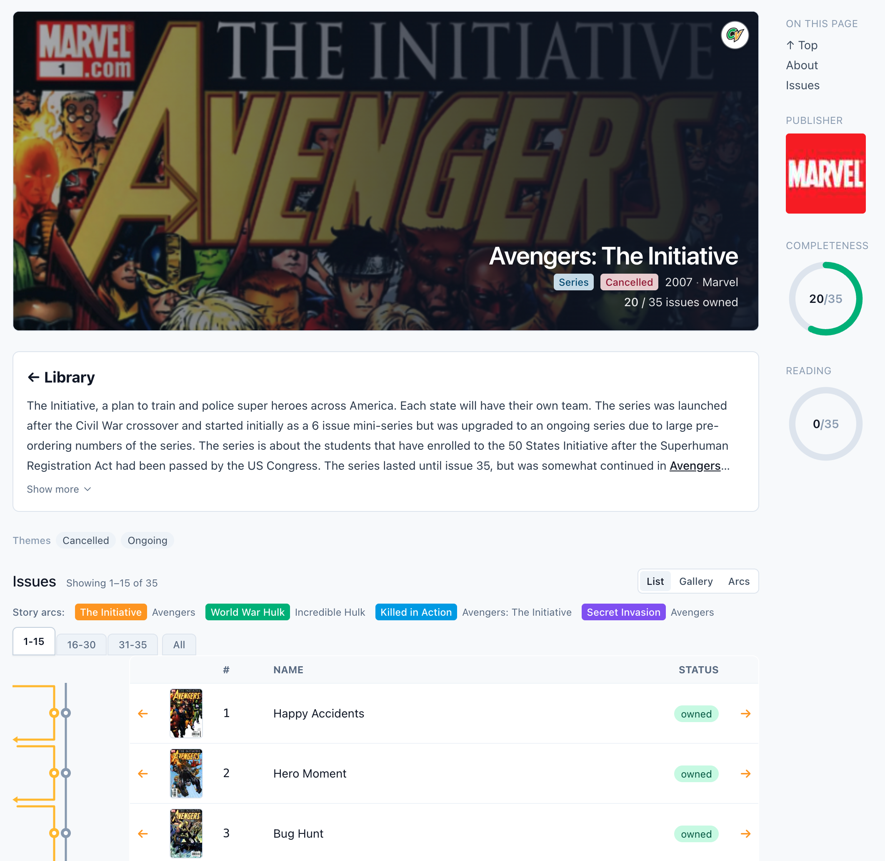

# Longboxes

> A self-hosted comic library that reads your collection by story — not by file.

[](https://github.com/longboxes/longboxes/actions/workflows/ci.yml)
[](LICENSE)
[](https://github.com/longboxes/longboxes/pkgs/container/longboxes)
[](https://docs.longboxes.app)


<!-- TODO: drop a hero screenshot into docs/screenshots/library.png -->

Longboxes scans the comic archives on your disk, matches each one to its
ComicVine entry, and then *builds a library around the story*. Issues
join their volume. Volumes join their story arc. Characters and creators
get their own pages with everything you own. Crossover events thread
across series. The graph that ComicVine has always exposed, made
walkable on your own server.

It runs as a Docker Compose stack. Your files stay on your disk. No
telemetry, no account required, no cloud round-trip.

## Features

- **Story-first navigation.** Browse by volume, character, creator, team, or story arc. A crossover event walks cleanly from one series into the next; characters get their own pages with every issue they appear in.
- **High-confidence matching.** A four-stage pipeline uses filename heuristics, `ComicInfo.xml`, cover dates, and ComicVine's catalogue to identify each archive. Confident matches go straight to your library; ambiguous ones land in a review queue you confirm in batches.
- **Built-in reader.** Browser-based page-by-page reader with fit-width/height, per-volume reading direction (manga toggle), and per-user resume position. A "continue reading" shelf grows on the home page.
- **Library-wide search.** Header search across volumes, issues, characters, creators, teams, and story arcs. Falls back to a one-click ComicVine catalogue search when nothing local matches.
- **Multi-user.** Roles, sessions, per-user reading progress, and an incognito reading toggle.
- **Content-aware.** Files are tracked by sha256, not path. Move an archive between folders and Longboxes recognises it as the same issue — your match state is preserved.
- **Yours.** GPL-3.0, self-hosted, zero telemetry. Files stay on your disk; your library data stays on your server.


<!-- TODO: drop a volume-page screenshot into docs/screenshots/volume.png -->


<!-- TODO: drop a reader screenshot into docs/screenshots/reader.png -->

## Quick start

You need Docker + Docker Compose and a free [ComicVine API key](https://comicvine.gamespot.com/api/) (sign-in required, takes a minute).

```sh
git clone https://github.com/longboxes/longboxes.git
cd longboxes
cp .env.example .env
# Edit .env: set LIBRARY_PATH to the host folder holding your comics
docker compose up -d
```

Open <http://localhost:8612> and follow the setup wizard. It prompts you to create the admin account, then paste your ComicVine API key. The scanner starts indexing immediately; matching begins as soon as the key is saved.

**First-run expectations.** The first scan hashes and parses every file; a 10,000-file library takes 30–90 minutes depending on disk speed. Subsequent scans complete in seconds because unchanged files take the path + mtime + size fast path.

The full walkthrough — including alternate compose layouts, env-var reference, scheduled scans, and how to point at multiple library roots — lives at **[docs.longboxes.app](https://docs.longboxes.app)**.

## Documentation

- **[Quick start](https://docs.longboxes.app/quick-start/)** — get the stack running
- **[Install](https://docs.longboxes.app/install/)** — full Docker, env, and storage options
- **[First scan](https://docs.longboxes.app/first-scan/)** — what to expect the first time Longboxes meets your library
- **[How matching works](https://docs.longboxes.app/matching/)** — why Longboxes matches volumes before issues, and how the review queue is structured
- **[Reading comics](https://docs.longboxes.app/reading/)** — reader features, manga mode, progress tracking, incognito reading
- **[Troubleshooting & FAQ](https://docs.longboxes.app/troubleshooting/)** — stuck on something?

## Status

Longboxes is pre-1.0 and self-hosted. The matcher, scanner, library browse, review queue, web reader, search, and admin tools are all built and running on real-world libraries up to ~50,000 files.

On the near-term roadmap:

- **Bulk volume fetch** for character / creator / team pages — drops cold-cache hydration latency from minutes to seconds.
- **Metadata sync** — keep each archive's embedded `ComicInfo.xml` reconciled against the ComicVine cache.
- **Cover-art matching** — bring perceptual hashing into the matcher as a tiebreaker for ambiguous candidates.

Design notes for these and other in-flight subsystems live in [`design/`](design/).

## Contributing

PRs and issues welcome. The stack is Python 3.12 + FastAPI + async SQLAlchemy + Jinja2 + Alpine.js + Tailwind CSS, backed by PostgreSQL + Redis and an RQ background worker pool.

For local development:

```sh
uv sync                       # creates .venv/ with all dependencies
just up                       # start the docker stack
just test                     # run pytest (creates a longboxes_test database)
just lint && just fmt         # ruff
```

The [`justfile`](justfile) documents every common development command. Architecture notes and design docs for major subsystems live in [`design/`](design/).

## License

Longboxes is free software, licensed under the **GNU General Public License, version 3.0** — see [`LICENSE`](LICENSE).

It depends on `comicfn2dict` (GPL-3.0) for filename parsing, which is why Longboxes itself is GPL-3.0. Longboxes is distributed as a Docker image that bundles its dependencies; every bundled package and its license is recorded in [`THIRD-PARTY-NOTICES.md`](THIRD-PARTY-NOTICES.md).
